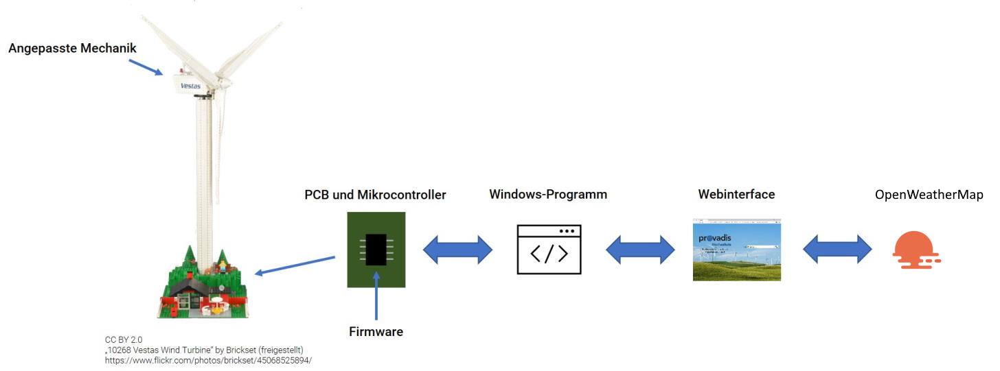

# Physikalischer Zwilling oder "das LEGO® Windrad"

Dieses programmgesteuerte LEGO®-Windrad wurde als Demonstration für die Vielfältigkeit allein der technischen Aufgaben in der Informatik entwickelt.

Basierend auf dem LEGO®-Modell 10268 wurde die **Mechanik** des Modells verändert, eine **Platine** designt, ein **Mikrocontroller** zur Steuerung programmiert sowie ein **Windows-Programm** zur Kommunikation mit dem Mikrocontroller entwickelt. Dazu gehört ebenfalls eine Benutzerschnittstelle in Form einer **Webseite** auf Basis von HTML 5, Javascript und CSS, welche wiederum mit dem Windows-Programm kommuniziert.

Youtube-Video: [https://www.youtube.com/watch?v=eUZm6J8IQgI](https://www.youtube.com/watch?v=eUZm6J8IQgI)

## Aufkleber

Das Originalmodell trägt Markierungen eines Windrad-Herstellers. Zur Anpassung an die Provadis-Hochschule kann man entweder Bausteine bedrucken lassen oder - der einfachere Weg - individuelle Aufkleber anbringen. Diese wurde also großflächiger transparenter Aufkleber produziert, von einem der gängigen Druckdienstleister erstellt und dann mit einem Skalpell ausgeschnitten.

Im Ordner `sticker` gibt es eine Powerpoint-Datei, die als Aufkleber gedruckt werden kann. Die meisten Druckdienstleister benötigen dazu eine PDF-Datei im CMYK-Farbsystem.

## Mechanik

Die Mechanik des Originalmodells wurde verändert, um eine genauere Kontrolle der Drehgeschwindigkeit zu ermöglichen. Dazu wurde die vorhandene Übersetzung entfernt, da die Geschwindigkeit nicht mehr konstant sein soll, sondern durch die Mikroelektronik geregelt wirde. Zusätzlich wird durch die Anpassung die maximale Drehzahl erhöht.

Im Ordner `building instructions` befindet sich eine Bauanleitung, welche die Bauschritte 80-97 sowie 103 und 126-138 anpasst. Die Quelldateien können mit der kostenlosen Software [Stud.io](https://www.bricklink.com/v3/studio/download.page) bearbeitet und als PDF-Datei exportiert werden.

## PCB

Zur Steuerung des Windrads wurde bereits für ein Vorgängerprojekt mit dem [House of IT](https://house-of-it.eu/) und dem [Fachgebiet Telekooperation der Technischen Universität Darmstadt](https://www.informatik.tu-darmstadt.de/telekooperation/telecooperation_group/index.en.jsp) eine Platine entwickelt, die in das Modell integriert wird. Zum Anschluss an die Platine ist eines der LEGO®-Stromkabel aufzutrennen (vgl. Video).

Im Ordner `pcb` sind die Quelldateien zur Nutzung mit der kostenlosen Software [Fritzing](https://fritzing.org/) gespeichert. Aus der Software heraus kann man auch direkt die Platinen bestellen und fertigen lassen. Ein Export als Gerber-Files für beliebige PCB-Hersteller ist ebenfalls möglich.

## Microcontroller

Herzstück der Platine ist ein *Arduino Micro* Mikrocontroller (oder ein beliebiger kompatibler Klon desselben). Die Firmware wurde als Arduino-Programm in der Sprache C++ umgesetzt.

Im Ordner `firmware` befindet sich der Quellcode für den Mikrocontroller. Er kann mit der kostenlosen Software [Arduino](https://www.arduino.cc/) kompiliert und auf den Mikrocontroller übertragen werden. Die Kalibrierungsdaten wurden experimentell erzeugt, sollten jedoch zu allen im Originalmodell verwendeten LEGO®-Motoren passen.

**Achtung:** Sowohl das PCB als auch die Firmware sind dafür vorbereitet, neben der Steuerung der Drehzahl auch die Belechtung des Modells zu steuern. Für den physikalischen Zwilling wurde diese Steuerung nicht umgesetzt; sie kann jedoch problemlos ergänzt werden.

## Webinterface

Die Benutzerschnittstelle ist als Webseite auf Basis von HTML 5, Javascript und CSS realisiert. Zum Abruf der Wetterdaten wird die API von [OpenWeather](https://openweathermap.org/) verwendet. Die Kommunikation mit der Treibersoftware unter Windows erfolgt via HTTP.

Im Ordner `webinterface` befinden sich die Quelldateien für das Webinterface.

**Achtung:** *(1)* In die Datei `index.html` muss ein individueller API-Key von OpenWeather eingetragen werden. *(2)* Einige Webbrowser verbieten lokal gespeicherten Seiten den Aufbau von HTTP-Verbindungen zu localhost (*CROSS-Origin Resource Sharing*), obwohl der HTTP-Server des Treiberprogramms die entsprechenden HTTP-Header sendet. Für die gängigen Webbrowser kann eine CORS-Erweiterung genutzt werden, um dieses Verhalten anzupasssen. Alternativ kann die Datei `index.html` über einen lokalen Webserver ausgeliefert werden.

## Treiberprogramm

Die Kommunikation zwischen Mikrocontroller und Webinterface wickelt ein Windows-Programm ab. Es wurde nicht als Windows-Treiber entwickelt, sondern nutzt den Standard-Arduino-Treiber, der ggf. gesondert installiert werden muss. Das Programm kommuniziert mit dem Webinterface über einen integrierten Webserver via HTTP. Die Verbindung zum Mikrocontroller wird über die serielle Schnittstelle (via USB) implementiert. Dabei übernimmt das Windows-Programm nur die Kommunikation; Schutzfunktionen wie das langsame Ramp-Up und der Spin-Down des Rotors werden allein durch die Firmware des Mikrocontrollers gesteuert und können nicht extern beeinflusst werden.

Im Ordner `server` befindet sich der C#-Quellcode, der als [Visual Studio Code-Projekt](https://code.visualstudio.com/) importiert werden kann.

---

LEGO® ist eine Marke der LEGO Gruppe, durch die das vorliegende Projekt jedoch weder gesponsert noch autorisiert oder unterstützt wird.
